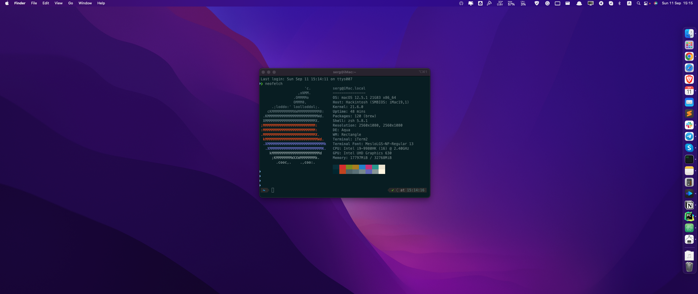

<!-- PROJECT LOGO -->
 

  

<h3 align="center">OpenCore 0.8.2 EFI folder for Asus z170e Hackintosh (Monterey 12.4) </h3>

  

    Hackintosh components:

     
     
<ul>
    <li>Motherboard: Asus z170e</li>
    <li>CPU: Intel i9 9980HK (Moded version for socket 1151)</li>
    <li>RAM: 32Gb DDR4 HyperX 2666Hz</li>
    <li>Bluetooth BCM_20702B0</li>
</ul>

  
Issues and problems

<!-- TABLE OF CONTENTS -->

  <ol>
    <li>
    Displays are connected to HDMI and DisplayPort. The one that is connected to DisplayPort flickered and was showing weird picture until I changed it's refresh rate with app SwitchResX to 61Hz. (Well, any custom refresh rate does the thing. Could not fix this issue with framebuffer patches. So this app is a lifesaver for me)
   
   <b>Integrated graphics UHD 630 works with device-id set to 9B3E0000 </b>
    </li> 
    <li>
    Bluetooth is a little weak. Sometimes Hackintosh won't unlock with Apple Watch due to the weak signal. But it's enough for using Airpods and Apple Mouse. No stutters.
    </li>
    </ol>
